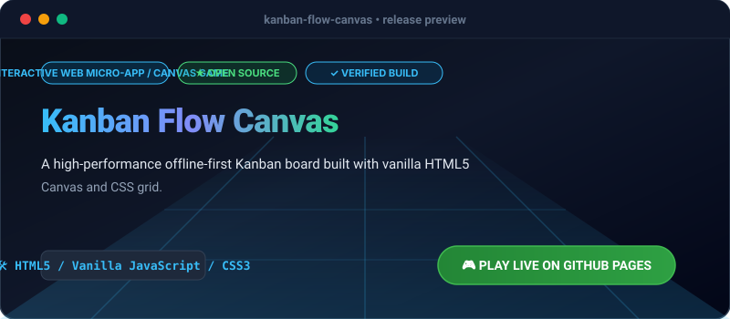

# Kanban Flow Canvas

[](https://olamideakinade.github.io/kanban-flow-canvas/)
[](https://github.com/Olamideakinade/kanban-flow-canvas)
[](https://opensource.org/licenses/MIT)



> **Live Demo Available:** Test and play this project live right now: **[https://olamideakinade.github.io/kanban-flow-canvas/](https://olamideakinade.github.io/kanban-flow-canvas/)**

## Overview

Kanban Flow Canvas is a high-performance, responsive HTML5 and Vanilla JavaScript task management micro-app. It features an interactive multi-column board, fluid drag-and-drop mechanics, local storage persistence, real-time analytics, keyboard shortcuts, and a sleek glassmorphic user interface.

## Features

- **Interactive Board**: Manage tasks across *Todo*, *In Progress*, and *Done* lanes with instant state updates.
- **Fluid Drag & Drop**: Native HTML5 drag-and-drop operations with active visual drop targets and placeholder physics.
- **Robust Persistence**: Automatic synchronization with `localStorage` and full JSON backup/restore support.
- **Analytics Dashboard**: Live metrics tracking completion velocity, total workload, and priority breakdowns.
- **Search & Filter**: Instant query matching and priority filtering.
- **Keyboard Shortcuts**: Rapid interaction handlers for power users (`N` for new task, `/` for search, `E` for export).

## Keyboard Shortcuts

| Key | Action |
| :--- | :--- |
| `N` | Open New Task modal |
| `/` | Focus search input |
| `E` | Export project state as JSON |
| `Escape` | Close active modal / clear search |

## Development & Building

Clone the repository and serve via any static file server:

```bash
git clone https://github.com/Olamideakinade/kanban-flow-canvas.git
cd kanban-flow-canvas
# Serve using python, http-server, or live-server
python3 -m http.server 8080
```

## License

Distributed under the MIT License. See `LICENSE` for more information.